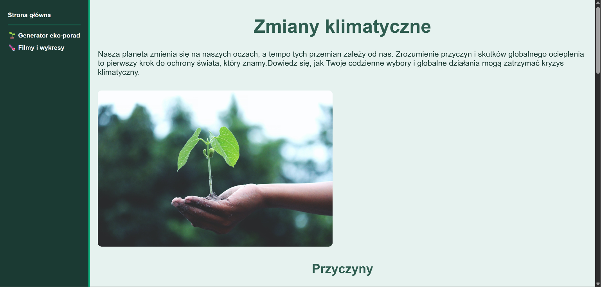
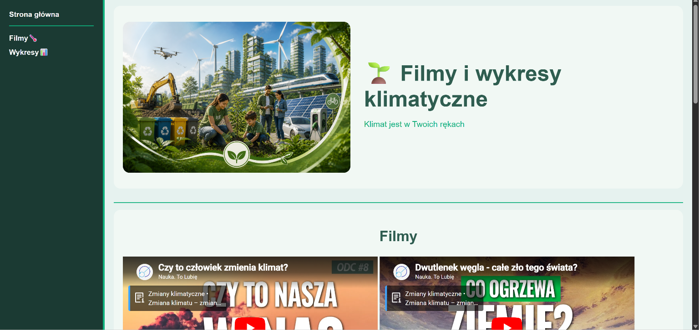
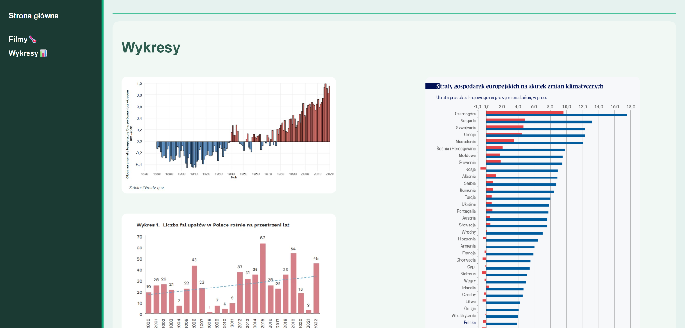
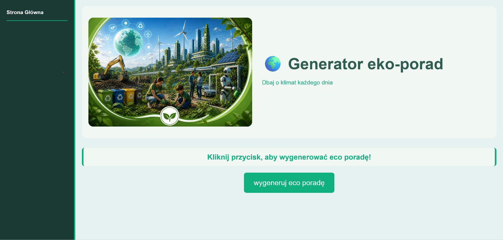

I created a website dedicated to climate change over the years. On the site, you can find videos and graphs showing how the global climate has changed over time.
You can also read information about climate change, learn ways to help prevent it, and generate your own eco-tips using a special generator.
The project was created using HTML and CSS.
Below are some photos and a video showing the website’s layout :)
______________________________________________________________________________________________________________________________________________________________________

______________________________________________________________________________________________________________________________________________________________________

